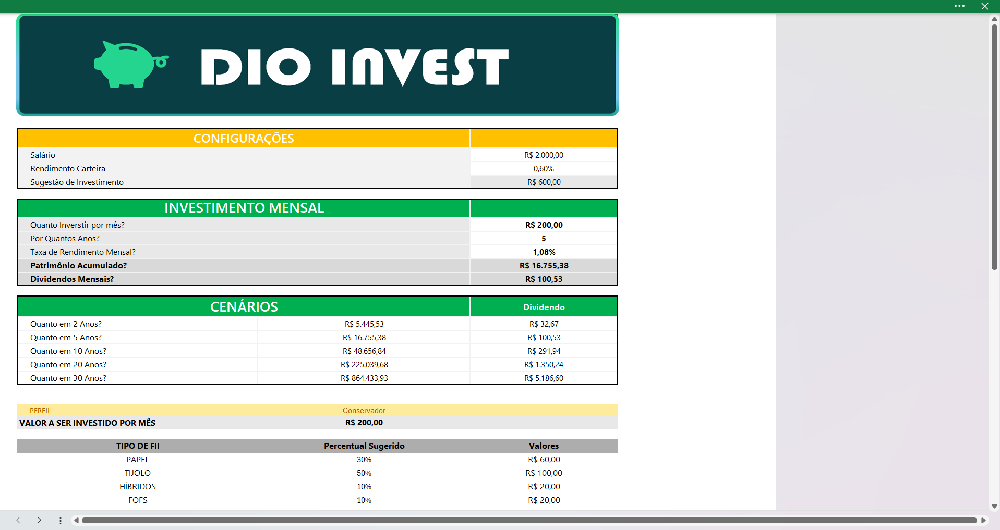
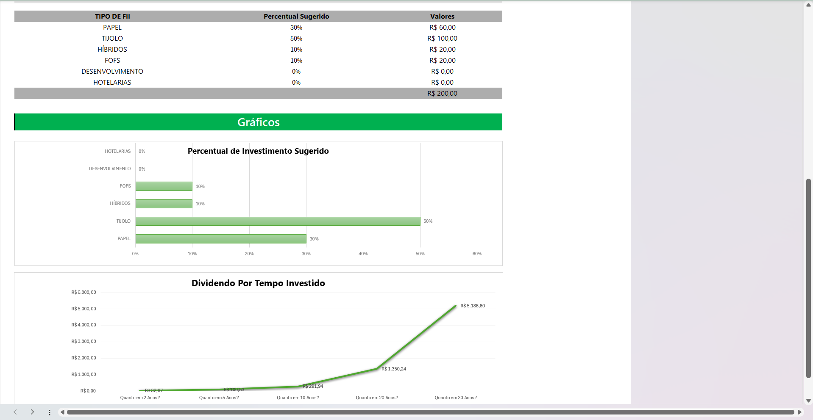

# Projeto 1: Simulador de Investimentos em Fundos Imobiliários - Excel

Este projeto apresenta uma ferramenta prática desenvolvida em Excel para simular investimentos em fundos imobiliários. A planilha permite ao usuário inserir dados de aportes mensais, rendimento por cota e quantidade de cotas, retornando automaticamente informações como:

- Valor total investido  
- Patrimônio acumulado  
- Dividendos mensais  

Com uma interface simples e direta, o simulador facilita a visualização da evolução dos investimentos ao longo do tempo. É ideal para quem está começando a investir e deseja entender melhor os impactos de decisões regulares de aporte e reinvestimento de dividendos.

Além disso, o modelo pode ser facilmente expandido e adaptado para atender diferentes estratégias e perfis de investidores.

## Funcionalidades

- Cálculo automático do valor total investido
- Estimativa dos dividendos mensais com base nos parâmetros inseridos
- Visualização da evolução do patrimônio
- Estrutura flexível para personalizações futuras

## Requisitos

- Microsoft Excel 2013 ou superior (compatível com versões que suportam fórmulas financeiras)

## Como usar

1. Baixe o arquivo `Projeto1.xlsx`.
2. Abra a planilha no Excel.
3. Preencha os campos conforme indicado (ex: valor de aporte, rendimento, número de cotas).
4. Os resultados serão calculados automaticamente nas células de saída.

## Licença

Este projeto é distribuído gratuitamente para fins educacionais e pode ser modificado conforme a necessidade do usuário.

## Imagens

