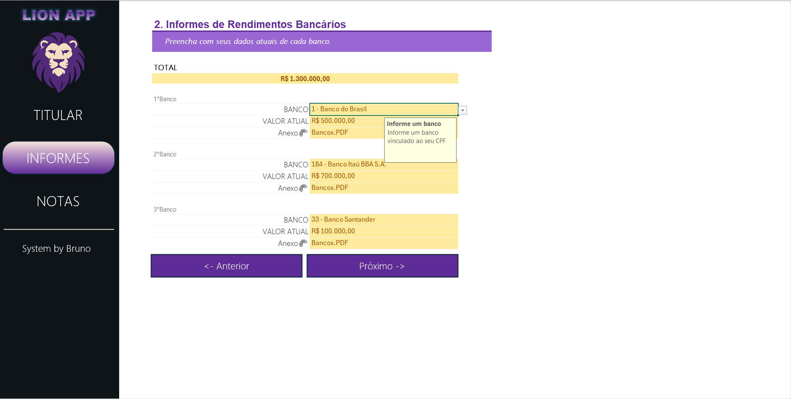
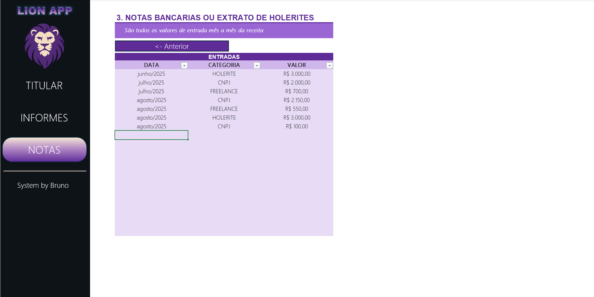

# Projeto 1: Simulador de Investimentos em Fundos Imobiliários - Excel

Este projeto apresenta uma ferramenta prática desenvolvida em Excel para simular investimentos em fundos imobiliários. A planilha permite ao usuário inserir dados de aportes mensais, rendimento por cota e quantidade de cotas, retornando automaticamente informações como:

- Valor total investido
- Patrimônio acumulado
- Dividendos mensais

Com uma interface simples e direta, o simulador facilita a visualização da evolução dos investimentos ao longo do tempo. É ideal para quem está começando a investir e deseja entender melhor os impactos de decisões regulares de aporte e reinvestimento de dividendos.

Além disso, o modelo pode ser facilmente expandido e adaptado para atender diferentes estratégias e perfis de investidores.

## Funcionalidades

- Cálculo automático do valor total investido
- Estimativa dos dividendos mensais com base nos parâmetros inseridos
- Visualização da evolução do patrimônio
- Estrutura flexível para personalizações futuras

## Requisitos

- Microsoft Excel 2013 ou superior (compatível com versões que suportam fórmulas financeiras)

## Como usar

1. Baixe o arquivo `Projeto1.xlsx`.
2. Abra a planilha no Excel.
3. Preencha os campos conforme indicado (ex: valor de aporte, rendimento, número de cotas).
4. Os resultados serão calculados automaticamente nas células de saída.

## Licença

Este projeto é distribuído gratuitamente para fins educacionais e pode ser modificado conforme a necessidade do usuário.

## Imagens

# Projeto 2: Organizador de Declaração de IRPF - Excel

Este projeto apresenta uma ferramenta prática desenvolvida em Excel para organização e controle dos dados necessários para a declaração anual do Imposto de Renda. A planilha permite ao usuário:

- Armazenar informações cadastrais completas
- Registrar saldos bancários e investimentos
- Controlar rendimentos mensais por categoria
- Acompanhar o patrimônio total consolidado

Com estrutura simples e intuitiva, o organizador facilita o agrupamento de todas as informações fiscais em um único local, otimizando o processo de preenchimento na declaração oficial.

## Funcionalidades

- **Cadastro completo do contribuinte** (dados pessoais, documentos e contatos)
- **Controle de ativos financeiros** (até 3 instituições bancárias)
- **Registro de rendimentos mensais** (classificação por tipo de receita)
- **Cálculo automático do patrimônio total**
- **Lista de referência de bancos brasileiros**

## Como usar

1. Baixe o arquivo `Projeto2.xlsx`
2. Preencha os dados nas abas correspondentes:
   - **Titular**: Informações pessoais
   - **Informes**: Saldos bancários
   - **Notas**: Rendimentos mensais
3. Para adicionar novos registros:
   - Inserir na próxima linha vazia da aba "Notas"
4. Atualize a tabela dinâmica manualmente quando necessário (Alt+F5)

## Requisitos

- Microsoft Excel 2010 ou superior
- Habilitar conteúdo ativo para visualização completa

## Estrutura do Arquivo

| Aba      | Função Principal                  |
| -------- | --------------------------------- |
| Titular  | Dados cadastrais do declarante    |
| Informes | Registro de contas bancárias      |
| Notas    | Controle de rendimentos mensais   |
| Bancos   | Lista de instituições financeiras |

## Licença

Este projeto é disponibilizado gratuitamente para fins de organização pessoal e pode ser adaptado conforme as necessidades do usuário.

## Observações Importantes

- Os cálculos não consideram regras específicas da legislação fiscal
- Recomenda-se conferir todos os valores com os documentos oficiais
- Manter cópias de segurança dos dados inseridos

## Imagens

_Dados cadastrais do contribuinte_

_Registro de contas bancárias_

_Registro de rendimentos mensais_
